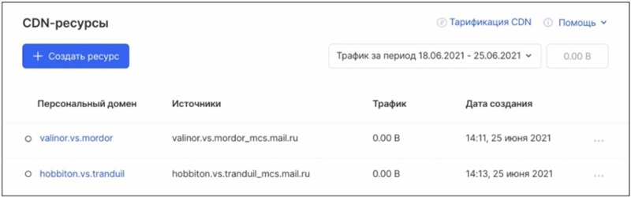
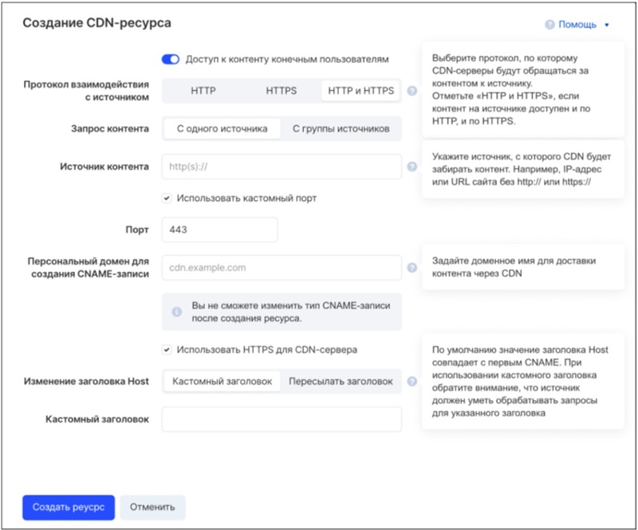
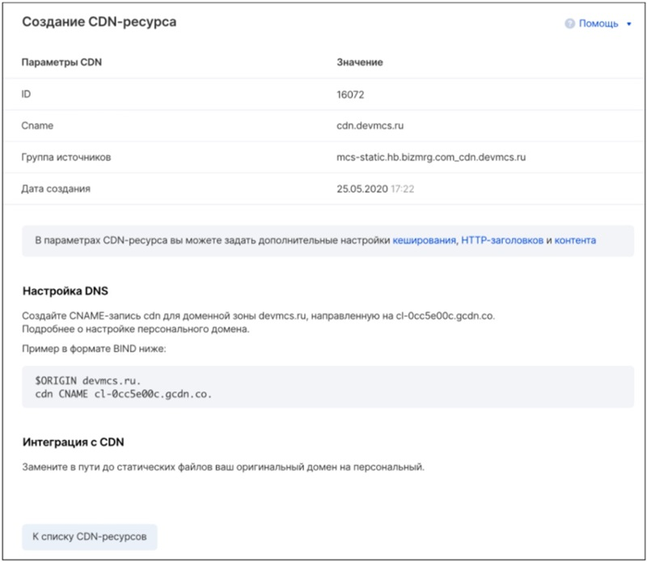

# Добавление ресурса

Для добавления ресурса следует нажать на кнопку **Создать ресурс**:

Затем — заполнить поля настроек в соответствии с описанием и пояснениями:

Опция **Доступ к контенту конечным пользователям** определяет доступность контента CDN-ресурса для пользователей:

- Включите опцию, чтобы после создания ресурса контент стал доступен всем.
- Отключите опцию, чтобы после применения настроек контент не был доступен никому.

Опция **Запрос контента** определяет, ко скольким источникам CDN-сервер будет обращаться для получения контента:

- _С одного источника_: в этом случае укажите адрес источника в поле **Источник контента**.
- _С группы источников_: в этом случае укажите группу источников с одним и тем же контентом в поле **Источник контента**.

В поле **Персональный домен для создания CNAME-записи** укажите свой домен вида _cdn.example.com_. Например, если доменное имя вашего сайта — _website.ru_, введите _cdn.website.ru_. Вместо _cdn_ вы можете указать любой другой поддомен для вашего основного домена.

Чтобы CDN-серверы отправляли корректные запросы к источникам, настройте опцию **Изменение заголовка Host** для этих запросов:

- _Кастомный заголовок_: в этом случае значением HTTP-заголовка _Host_ будет произвольное доменное имя, которое вы определите в поле **Кастомный заголовок**.
- _Пересылать заголовок_: значение HTTP-заголовка _Host_ при запросе от CDN к источнику контента будет такое же, как у заголовка Host в запросе клиента к CDN.

После нажатия на кнопку **Создать реусрс** _(прим. - опечатка в тексте кнопки)_ CDN-ресурс будет создан с учетом выбранных настроек:

